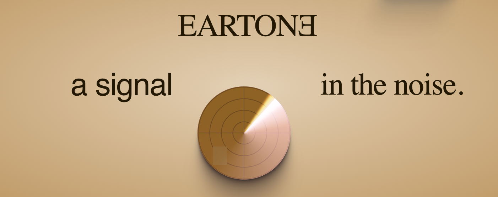
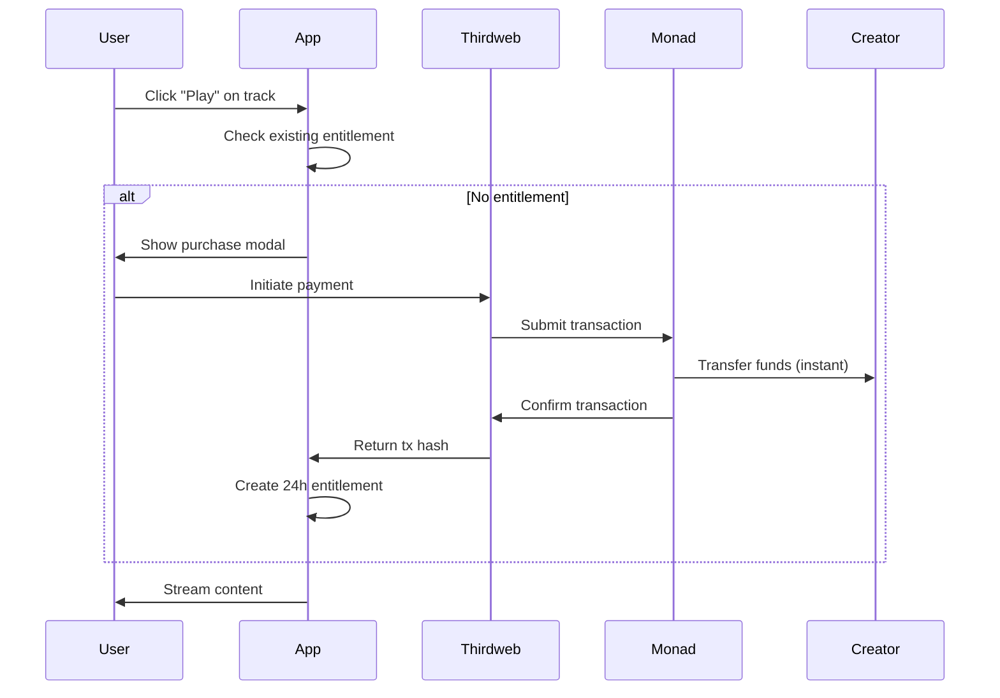

<p align="center">
  
</p>

# EARTONE

### A Signal in the Noise

> **Content. Music. Media. CULTURE.**
> Access Here : eartone.lovable.app
> Direct-to-creator distribution powered by Thirdweb on Monad.

[](https://monad.xyz)
[](https://thirdweb.com)
[](LICENSE)

---

## 🎯 Overview

**EARTONE** is a premium creator platform that fundamentally reimagines how content reaches audiences and how creators get paid. By leveraging Monad's high-performance blockchain and Thirdweb's seamless web3 infrastructure, we've built a frictionless pay-per-stream economy where every play directly compensates the artist.

No middlemen. No delays. No gatekeepers. Just creators and their audience, connected through culture.

---

## ✨ Key Features

### For Audiences
- **Pay-Per-Stream** — Only pay for what you consume. No subscriptions, no commitments.
- **24-Hour Access** — Each purchase unlocks unlimited streams for 24 hours.
- **Instant Discovery** — AI-powered recommendations based on your taste profile.
- **Cross-Media Experience** — Music, video, articles — all in one curated platform.

### For Creators
- **Direct Payments** — Funds flow directly to your wallet. No 30-day holds.
- **Set Your Price** — You decide what your art is worth.
- **Real-Time Analytics** — Track streams, earnings, and audience engagement live.
- **Zero Platform Fees** — Keep 100% of your streaming revenue.*

### For Culture
- **Independent Voices** — A platform built for artists, not algorithms.
- **Transparent Economy** — Every transaction is verifiable on-chain.
- **Community Owned** — Future governance by creators and collectors.

---

## 🏗️ Architecture

```
┌─────────────────────────────────────────────────────────────────┐
│                        EARTONE Platform                         │
├─────────────────────────────────────────────────────────────────┤
│                                                                 │
│  ┌─────────────┐  ┌─────────────┐  ┌─────────────┐             │
│  │   Listen    │  │    Watch    │  │    Read     │             │
│  │   (Audio)   │  │   (Video)   │  │  (Articles) │             │
│  └──────┬──────┘  └──────┬──────┘  └──────┬──────┘             │
│         │                │                │                     │
│         └────────────────┼────────────────┘                     │
│                          │                                      │
│                    ┌─────▼─────┐                                │
│                    │  Unified  │                                │
│                    │  Player   │                                │
│                    └─────┬─────┘                                │
│                          │                                      │
├──────────────────────────┼──────────────────────────────────────┤
│                          │                                      │
│  ┌───────────────────────▼───────────────────────┐             │
│  │              Thirdweb SDK Layer               │             │
│  │  • Wallet Connection (Connect Wallet Modal)   │             │
│  │  • Smart Contract Interactions                │             │
│  │  • Transaction Management                     │             │
│  │  • Gas Abstraction                           │             │
│  └───────────────────────┬───────────────────────┘             │
│                          │                                      │
├──────────────────────────┼──────────────────────────────────────┤
│                          │                                      │
│  ┌───────────────────────▼───────────────────────┐             │
│  │              Monad Blockchain                 │             │
│  │  • High-throughput transaction processing    │             │
│  │  • Sub-second finality                       │             │
│  │  • EVM compatibility                         │             │
│  │  • Low transaction costs                     │             │
│  └───────────────────────────────────────────────┘             │
│                                                                 │
└─────────────────────────────────────────────────────────────────┘
```

---

## 🛠️ Tech Stack

| Layer | Technology | Purpose |
|-------|------------|---------|
| **Frontend** | React 18 + TypeScript | UI Components & State |
| **Styling** | Tailwind CSS + shadcn/ui | Design System |
| **Animation** | Framer Motion | Micro-interactions & Transitions |
| **Routing** | React Router v6 | Navigation |
| **Backend** | Supabase | Database, Auth, Storage, Edge Functions |
| **Blockchain** | Monad (Testnet/Mainnet) | Transaction Layer |
| **Web3** | Thirdweb SDK | Wallet Connection, Contracts, Payments |
| **Build** | Vite | Development & Bundling |

---

## 🚀 Quick Start

### Prerequisites

- Node.js 18+ or Bun
- A Monad-compatible wallet (MetaMask, Coinbase Wallet, etc.)
- Supabase project (for backend services)

### Installation

```bash
# Clone the repository
git clone https://github.com/eartone/eartone-platform.git
cd eartone-platform

# Install dependencies
bun install
# or
npm install

# Set up environment variables
cp .env.example .env.local
```

### Environment Configuration

```env
# Supabase
VITE_SUPABASE_URL=your_supabase_url
VITE_SUPABASE_PUBLISHABLE_KEY=your_supabase_anon_key

# Thirdweb
VITE_THIRDWEB_CLIENT_ID=your_thirdweb_client_id

# Monad Network
VITE_CHAIN_ID=10143  # Monad Testnet
# VITE_CHAIN_ID=TBD  # Monad Mainnet (coming soon)
```

### Development

```bash
# Start development server
bun dev
# or
npm run dev

# Build for production
bun run build

# Preview production build
bun run preview
```

---

## 📁 Project Structure

```
eartone-platform/
├── public/                 # Static assets
├── src/
│   ├── components/         # Reusable UI components
│   │   ├── ui/            # shadcn/ui primitives
│   │   └── upload/        # Content upload forms
│   ├── contexts/          # React contexts
│   │   ├── PlayerContext  # Audio/video playback state
│   │   ├── WalletContext  # Thirdweb wallet state
│   │   └── ThemeContext   # Dark/light mode
│   ├── hooks/             # Custom React hooks
│   ├── integrations/      # Third-party integrations
│   │   └── supabase/      # Supabase client & types
│   ├── lib/               # Utility functions
│   │   ├── thirdweb.ts    # Thirdweb configuration
│   │   └── utils.ts       # General utilities
│   ├── pages/             # Route components
│   │   ├── Home.tsx       # Main feed
│   │   ├── Search.tsx     # Discovery
│   │   ├── Library.tsx    # User collection
│   │   ├── Upload.tsx     # Creator studio
│   │   ├── NowPlaying.tsx # Full player view
│   │   └── Landing.tsx    # Marketing page
│   └── types/             # TypeScript definitions
├── supabase/
│   ├── functions/         # Edge functions
│   │   ├── get-stream/    # Secure content delivery
│   │   ├── pay-stream/    # Payment processing
│   │   └── verify-payment/# Transaction verification
│   └── migrations/        # Database schema
└── ...config files
```

---

## 💰 Payment Flow



---

## 🎨 Design System

EARTONE uses a refined, editorial aesthetic with these core principles:

### Typography
- **Display**: Playfair Display (serif, elegant)
- **Body**: Inter (clean, readable)
- **Accent**: Cormorant Garamond (editorial flair)

### Color Palette
```css
/* Dark Theme (Default) */
--background: 0 0% 3.9%;
--foreground: 0 0% 98%;
--primary: 262.1 83.3% 57.8%;      /* Violet */
--secondary: 240 3.7% 15.9%;
--accent: 240 4.8% 95.9%;
--muted: 240 3.7% 15.9%;

/* Semantic Colors */
--success: 142 76% 36%;            /* Green */
--warning: 38 92% 50%;             /* Amber */
--destructive: 0 84.2% 60.2%;      /* Red */
```

### Motion
- **Easing**: `[0.22, 1, 0.36, 1]` (smooth, natural)
- **Duration**: 200-500ms for UI, 800ms+ for page transitions
- **Philosophy**: Motion should feel intentional, not decorative

---

## 🔐 Security

- **Wallet Authentication**: Non-custodial, user controls keys
- **Content Protection**: Signed URLs with expiration
- **Payment Verification**: On-chain confirmation required
- **Rate Limiting**: Edge function protection against abuse

---

## 🗺️ Roadmap

### Phase 1: Foundation ✅
- [x] Core streaming infrastructure
- [x] Thirdweb wallet integration
- [x] Pay-per-stream payments
- [x] Creator upload portal
- [x] Monad testnet deployment

### Phase 2: Experience (Current)
- [x] Onboarding flow with taste learning
- [x] Interactive walkthrough tour
- [ ] Mobile-responsive refinements
- [ ] Push notifications
- [ ] Social sharing

### Phase 3: Scale
- [ ] Monad mainnet launch
- [ ] Creator verification program
- [ ] Playlist curation tools
- [ ] Collaborative playlists
- [ ] API for third-party integrations

### Phase 4: Ecosystem
- [ ] Creator token launches
- [ ] Fan rewards program
- [ ] Live streaming support
- [ ] Governance token
- [ ] DAO transition

---

## 🤝 Contributing

We welcome contributions from the community! Please read our [Contributing Guide](CONTRIBUTING.md) before submitting PRs.

### Development Workflow

1. Fork the repository
2. Create a feature branch (`git checkout -b feature/amazing-feature`)
3. Commit your changes (`git commit -m 'Add amazing feature'`)
4. Push to the branch (`git push origin feature/amazing-feature`)
5. Open a Pull Request

### Code Standards

- TypeScript strict mode
- ESLint + Prettier formatting
- Component-driven architecture
- Accessible (WCAG 2.1 AA)

---

## 📄 License

This project is licensed under the MIT License — see the [LICENSE](LICENSE) file for details.

---

## 🙏 Acknowledgments

- **Monad** — For building the future of high-performance blockchain
- **Thirdweb** — For making web3 development accessible
- **Supabase** — For the incredible backend infrastructure
- **shadcn** — For the beautiful component primitives
- **Our Creators** — For trusting us with their art

---

<p align="center">
  <strong>EARTONE</strong><br>
  <em>A Signal in the Noise</em><br><br>
  <a href="https://eartone.xyz">Website</a> •
  <a href="https://twitter.com/eartone">Twitter</a> •
  <a href="https://discord.gg/eartone">Discord</a>
</p>

---

<p align="center">
  
  &nbsp;&nbsp;&nbsp;
  
</p>
